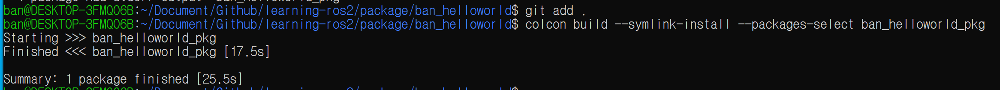
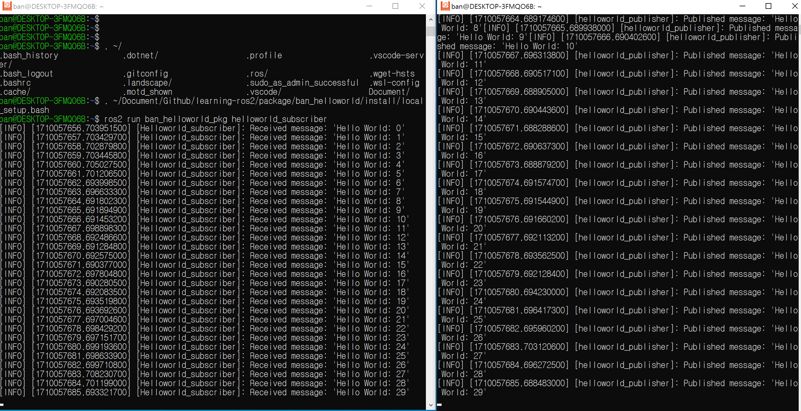

## create
1. 생성  

    ```
    ros2 pkg create ban_helloworld --build-type ament_cmake --d
    ependencies rclcpp std_msgs
    ```

2. 빌드  
    ```
    colcon build --symlink-install --packages-select ban_helloworld_pkg
    ```

3. 실행패키지 추가
    ```
    . ~/Document/Github/learning-ros2/package/ban_helloworld/install/local_setup.bash
    ```

4. 실행
    ```
    ros2 run ban_helloworld_pkg helloworld_publisher
    ```

    ```
    ros2 run ban_helloworld_pkg helloworld_subscriber
    ```

5. 결과  

     

   